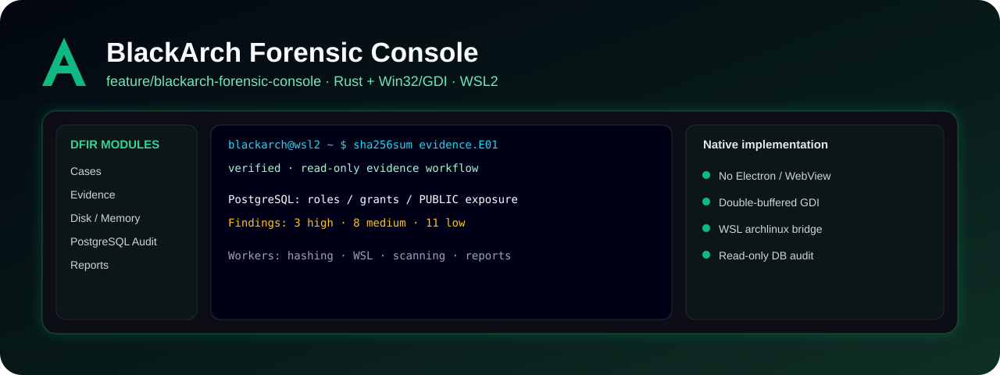

<div align="center">

# BlackArch Forensic Console

### Implementación nativa experimental · Rust + Win32/GDI + WSL2

**Workspace DFIR para Windows 11 conectado a Arch/BlackArch dentro de WSL2, con énfasis en rendimiento, evidencia y auditoría defensiva.**


</div>



> **Rama:** `feature/blackarch-forensic-console`  
> Esta es la implementación **nativa Win32/GDI**. Es distinta de `blackarch-forensic-console`, que se usa como staging visual con eframe/egui.

## Qué contiene esta rama

El proyecto forense está dentro de:

```text
blackarch-forensic-console/
```

La aplicación está escrita en Rust y utiliza Win32/GDI directamente, evitando Electron o WebView para mantener bajo el consumo y un comportamiento de escritorio más predecible.

## Capacidades de la versión experimental

### Gestión de evidencia

- registro de archivos de evidencia;
- cálculo de SHA-256;
- verificación posterior del hash;
- soporte de drag & drop;
- orientación a flujos de trabajo read-only;
- panel de detalles y cadena de custodia.

### Integración WSL2

La aplicación utiliza la distro:

```text
archlinux
```

para ejecutar herramientas disponibles en Arch/BlackArch sin bloquear el hilo principal de la interfaz.

### Auditoría defensiva de proyectos

Permite analizar carpetas de trabajo de forma acotada para identificar:

- archivos potencialmente sensibles;
- patrones de secretos;
- configuraciones riesgosas;
- elementos que requieren revisión manual.

El escáner limita archivos y tamaño por archivo y evita imprimir directamente valores de secretos detectados.

### Auditoría PostgreSQL

La auditoría está diseñada como **read-only** y revisa metadatos relacionados con:

- roles privilegiados;
- grants;
- permisos concedidos a `PUBLIC`;
- esquemas con `PUBLIC CREATE`;
- exposición de tablas.

No intenta explotar PostgreSQL ni modificar datos.

### Reportes

El flujo permite producir reportes Markdown asociados al caso para conservar resultados y hallazgos.

## Diseño técnico

```text
Windows 11
   │
   ├── BlackArch Forensic Console
   │      Rust + Win32/GDI
   │
   ├── Worker threads
   │      ├── Hashing
   │      ├── WSL commands
   │      ├── PostgreSQL audit
   │      └── Project scan
   │
   └── WSL2
          └── archlinux
               └── Arch + BlackArch tools
```

El render utiliza double buffering para reducir parpadeo. Las operaciones lentas se mueven fuera del hilo de UI.

## Requisitos

- Windows 11 x64;
- WSL2;
- distro `archlinux`;
- Rust estable;
- Visual Studio Build Tools con C++;
- `psql` dentro de Arch/BlackArch para auditoría PostgreSQL.

## Compilar

```powershell
git clone --branch feature/blackarch-forensic-console https://github.com/alviomedina100041-prog/archyter-desktop.git
cd archyter-desktop\blackarch-forensic-console

.\scripts\build-windows.ps1
```

La salida esperada se coloca en:

```text
dist\BlackArchForensicConsole.exe
```

También existe un instalador de toolchain/proyecto:

```powershell
.\scripts\install.ps1 -InstallToolchain
```

## PostgreSQL

La aplicación no debe guardar la contraseña. El destino se configura mediante variables de entorno:

```powershell
$env:BLACKARCH_PGHOST="127.0.0.1"
$env:BLACKARCH_PGPORT="5433"
$env:BLACKARCH_PGDATABASE="erpcontrol"
$env:BLACKARCH_PGUSER="auditor"
```

La autenticación de `psql` puede administrarse mediante `~/.pgpass` dentro de WSL con permisos adecuados.

## Documentación técnica

Dentro del proyecto consulta:

```text
blackarch-forensic-console/docs/architecture.md
```

para arquitectura, decisiones técnicas y roadmap.


## Mapa de ramas

| Rama | Propósito |
|---|---|
| `main` | Edición principal de Archyter Desktop para Arch Linux. |
| `windows-studio` | Edición de Archyter Studio para Windows 10/11. |
| `feature/blackarch-forensic-console` | Implementación forense nativa en Rust + Win32/GDI con integración WSL2. |
| `blackarch-forensic-console` | Prototipo/staging visual en Rust + eframe/egui para el workspace DFIR. |

Cada rama mantiene su propio README e imagen para que GitHub muestre claramente qué producto estás viendo.

