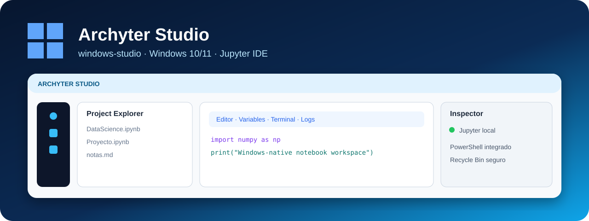

<div align="center">


# Archyter Studio

### Edición para Windows 10 / Windows 11

**Un entorno de notebooks con shell de escritorio propio, explorador de proyectos, Jupyter local y herramientas integradas de Windows.**


</div>



> **Rama:** `windows-studio`  
> Esta rama contiene exclusivamente la edición de Windows. No representa la interfaz ni el instalador de la rama principal de Arch Linux.

## Objetivo

Archyter Studio adapta la experiencia de Archyter al escritorio de Windows manteniendo Jupyter como motor de notebooks, pero envolviéndolo con una interfaz propia.

El diseño aprobado de esta rama prioriza:

- interfaz clara con acentos azules;
- navegación lateral;
- explorador de proyectos;
- workspace central orientado al notebook;
- paneles de kernel, variables, terminal y logs;
- integración con PowerShell;
- manejo de proyectos recientes;
- instalación nativa para el menú Inicio.

El contrato visual y de comportamiento se documenta en:

```text
docs/WINDOWS_DESIGN_CONTRACT.md
```

## Funciones principales

### Workspace de notebooks

- JupyterLab ejecutado localmente.
- Vista embebida dentro de la aplicación.
- Soporte para notebooks y archivos del proyecto.
- Controles explícitos de guardado, ejecución y kernel.

### Explorador de proyectos

- navegación por carpetas;
- iconos locales confiables;
- selección y apertura de archivos;
- eliminación segura usando la **Papelera de reciclaje de Windows**;
- administración de proyectos recientes.

### Paneles de trabajo

- información del kernel;
- variables;
- PowerShell;
- terminal;
- logs;
- herramientas auxiliares sin depender de una consola externa.

### Seguridad local

El servidor Jupyter se mantiene vinculado a `127.0.0.1`, evitando exposición innecesaria en la red.

## Requisitos

- Windows 10 o Windows 11;
- Python 3.11 o superior;
- conexión a Internet durante la primera instalación de dependencias.

## Probar desde código fuente

```powershell
git clone --branch windows-studio https://github.com/alviomedina100041-prog/archyter-desktop.git Archyter-Studio
cd Archyter-Studio

py -3 -m venv .venv
.\.venv\Scripts\Activate.ps1
python -m pip install --upgrade pip
pip install -r requirements-windows.txt

python -m studio.main
```

Si PowerShell bloquea la activación del entorno, puedes utilizar directamente:

```powershell
.\.venv\Scripts\python.exe -m pip install -r requirements-windows.txt
.\.venv\Scripts\python.exe -m studio.main
```

## Instalación en Windows

```powershell
Set-ExecutionPolicy -Scope Process Bypass
.\scripts\install_windows.ps1
```

La instalación privada se guarda en:

```text
%LOCALAPPDATA%\ArchyterStudio
```

Para desinstalar:

```powershell
Set-ExecutionPolicy -Scope Process Bypass
.\scripts\uninstall_windows.ps1
```

## Validación de calidad

La rama dispone de CI para Windows. El flujo valida, entre otras cosas:

- instalación de dependencias;
- compilación/sintaxis del código;
- arranque de Jupyter;
- creación y apertura de notebooks;
- explorador e iconos;
- señalización de borrado;
- shell de Windows;
- construcción de la ventana Qt/WebEngine;
- screenshot de smoke test.

La CI ayuda a detectar regresiones, aunque no sustituye las pruebas manuales en hardware real.


## Mapa de ramas

| Rama | Propósito |
|---|---|
| `main` | Edición principal de Archyter Desktop para Arch Linux. |
| `windows-studio` | Edición de Archyter Studio para Windows 10/11. |
| `feature/blackarch-forensic-console` | Implementación forense nativa en Rust + Win32/GDI con integración WSL2. |
| `blackarch-forensic-console` | Prototipo/staging visual en Rust + eframe/egui para el workspace DFIR. |

Cada rama mantiene su propio README e imagen para que GitHub muestre claramente qué producto estás viendo.

