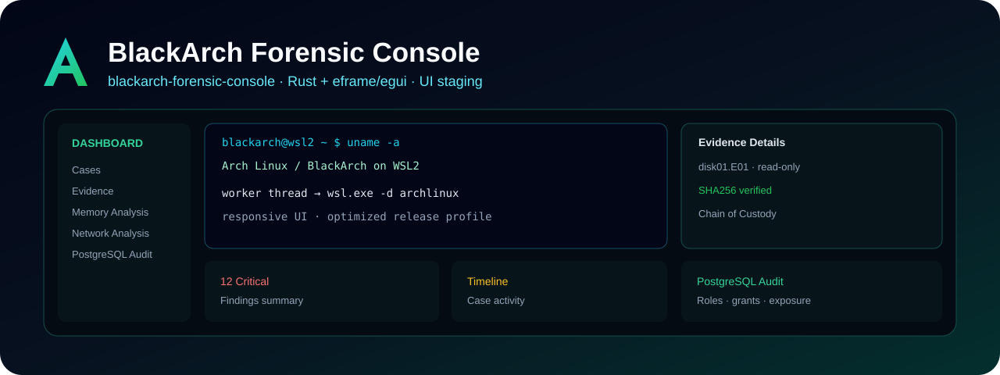

<div align="center">

# BlackArch Forensic Console

### UI staging · Rust + eframe/egui + WSL2

**Rama visual para construir y validar el dashboard DFIR aprobado antes de conectar todos los motores forenses.**


</div>



> **Rama:** `blackarch-forensic-console`  
> Esta rama se mantiene separada de la implementación Win32/GDI para experimentar con la interfaz eframe/egui y validar el diseño del workspace.

## Propósito

Este branch reproduce el concepto visual de **BLACKARCH FORENSIC CONSOLE** como una aplicación nativa en Rust enfocada en:

- dashboard DFIR;
- navegación por módulos;
- Case Explorer;
- terminal WSL;
- Evidence Details;
- hashes;
- Chain of Custody;
- Findings Summary;
- Timeline;
- Hex Preview;
- PostgreSQL Audit Summary.

La prioridad actual es mantener una UI responsiva, modular y cercana al mockup aprobado.

## Arquitectura del prototipo

```text
BlackArch Forensic Console
        Rust + eframe/egui
                │
        ┌───────┴────────┐
        │                │
       UI           Worker thread
        │                │
        │          wsl.exe -d archlinux
        │                │
        └──────────► Arch / BlackArch WSL2
```

Los comandos WSL se diseñan para ejecutarse fuera del hilo de interfaz con el objetivo de evitar congelamientos.

## Estado de módulos

| Módulo | Estado en esta rama |
|---|---|
| Dashboard | UI implementada |
| Case Explorer | UI base |
| Terminal WSL | integración base |
| Evidence Details | UI base |
| Hashes | representación de UI |
| Chain of Custody | representación de UI |
| Findings | UI base |
| Timeline | UI base |
| Hex Preview | UI base |
| PostgreSQL Audit | panel de UI / staging |
| Integración completa de herramientas DFIR | roadmap |

Esta rama no debe confundirse con una suite forense terminada. Es el **staging de interfaz y arquitectura** sobre el cual se conectarán las herramientas reales.

## Código fuente disponible

Actualmente el paquete de código fuente está versionado como:

```text
blackarch-forensic-console-source.zip
```

Para trabajar con él:

```powershell
Expand-Archive .\blackarch-forensic-console-source.zip .\blackarch-forensic-console
cd .\blackarch-forensic-console
cargo run --release
```

## Requisitos

- Windows 11;
- WSL2;
- distro `archlinux`;
- Rust estable;
- Visual Studio Build Tools C++ para el target MSVC.

## Perfil de release

El prototipo usa un perfil enfocado en reducir overhead:

```toml
[profile.release]
opt-level = 3
lto = "fat"
codegen-units = 1
panic = "abort"
strip = "symbols"
```

## CI

La rama contiene un workflow de Windows que extrae el paquete fuente y ejecuta:

```text
cargo fmt --check
cargo test
cargo clippy -D warnings
cargo build --release
```

La existencia del workflow no implica que una revisión concreta haya pasado hasta que GitHub Actions la marque como exitosa.


## Mapa de ramas

| Rama | Propósito |
|---|---|
| `main` | Edición principal de Archyter Desktop para Arch Linux. |
| `windows-studio` | Edición de Archyter Studio para Windows 10/11. |
| `feature/blackarch-forensic-console` | Implementación forense nativa en Rust + Win32/GDI con integración WSL2. |
| `blackarch-forensic-console` | Prototipo/staging visual en Rust + eframe/egui para el workspace DFIR. |

Cada rama mantiene su propio README e imagen para que GitHub muestre claramente qué producto estás viendo.

