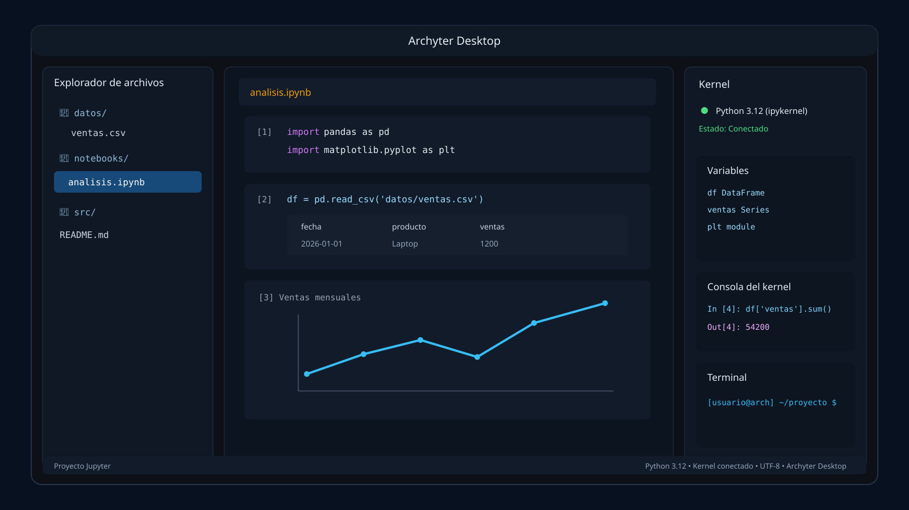

# Archyter Desktop

**Archyter Desktop** es una aplicación de escritorio para Arch Linux que ejecuta **JupyterLab dentro de una ventana nativa** usando **PySide6 + Qt WebEngine**.

La idea es conservar la lógica real de Jupyter: notebooks `.ipynb`, kernels, celdas, Markdown, pandas, matplotlib y extensiones siguen siendo Jupyter. Lo que cambia es la experiencia visual: ya no necesitas trabajar en una ventana normal de Firefox o Chrome.



## Características

- Ventana de escritorio nativa con tema blanco/claro estilo Arch/KDE.
- JupyterLab embebido sin barra de URL ni controles de navegador.
- Explorador de archivos lateral.
- Toolbar con Nuevo, Guardar, Ejecutar, Kernel, Terminal y Ajustes.
- Panel derecho con estado del kernel, variables, logs y mini terminal.
- Servidor Jupyter local limitado a `127.0.0.1`.
- Token local generado al iniciar.
- Launcher `.desktop`.
- Instalador para Arch Linux.

## Instalación en Arch

```bash
git clone https://github.com/alviomedina100041-prog/archyter-desktop.git
cd archyter-desktop
chmod +x scripts/install_arch.sh
./scripts/install_arch.sh
```

Después:

```bash
source .venv/bin/activate
./scripts/run_archyter.sh
```

También aparecerá **Archyter Desktop** en el menú de aplicaciones.

## Uso

Abre Archyter desde el menú o ejecuta:

```bash
source .venv/bin/activate
python -m app.main
```

Archyter levanta JupyterLab en un puerto local libre, lo carga dentro de Qt WebEngine y mantiene los archivos en formato estándar de Jupyter.

## Estructura

```text
archyter-desktop/
├── app/
│   ├── __init__.py
│   ├── main.py
│   ├── jupyter_manager.py
│   ├── theme.py
│   ├── window.py
│   └── widgets/
│       ├── __init__.py
│       ├── file_explorer.py
│       ├── kernel_panel.py
│       ├── log_console.py
│       ├── mini_terminal.py
│       └── variables_panel.py
├── assets/
│   ├── icon.svg
│   └── mockup.svg
├── scripts/
│   ├── install_arch.sh
│   └── archyter-desktop.desktop
├── requirements.txt
└── README.md
```

## Filosofía

Archyter no crea un formato propietario. Tus notebooks siguen siendo `.ipynb` normales y pueden abrirse en JupyterLab, VS Code, Windows, Linux o cualquier otra instalación compatible.

## Estado

Primera versión funcional para probar en Arch Linux. A partir de aquí se puede pulir la interfaz con la misma dinámica de desarrollo iterativo usada en otros proyectos.


## Intel Haswell / VA-API

Archyter usa por defecto un perfil conservador para GPUs Intel antiguas:

- renderizado Qt por software;
- Vulkan desactivado para QtWebEngine/Chromium;
- aceleración de vídeo desactivada dentro de QtWebEngine;
- `LIBVA_DRIVER_NAME=i965` para Intel Haswell y anteriores.

En Arch Linux, `libva-intel-driver` proporciona `i965_drv_video.so`. El instalador lo añade automáticamente.

Para verificarlo:

```bash
LIBVA_DRIVER_NAME=i965 vainfo
```

Si quieres experimentar con aceleración por hardware más adelante:

```bash
ARCHYTER_HW_ACCEL=1 python -m app.main
```
