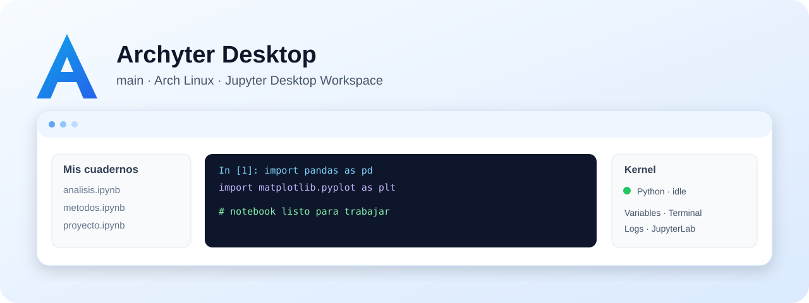

<div align="center">


# Archyter Desktop

### Edición principal para Arch Linux

**JupyterLab convertido en una experiencia de escritorio propia, ligera y enfocada en productividad.**


</div>



> **Rama:** `main`  
> Esta es la edición base de Archyter para **Arch Linux**. Las variantes de Windows y BlackArch viven en ramas separadas para no mezclar interfaces, dependencias ni objetivos.

## ¿Qué es Archyter Desktop?

Archyter Desktop conserva el ecosistema real de **Jupyter** —servidor, kernels, notebooks `.ipynb`, ejecución de celdas y outputs— y lo coloca dentro de una aplicación de escritorio creada con **PySide6 + Qt WebEngine**.

No utiliza un formato propietario para notebooks. Los archivos creados aquí siguen siendo compatibles con JupyterLab, Jupyter Notebook, VS Code y otras herramientas del ecosistema.

La meta de esta rama es ofrecer una experiencia limpia en Linux: abrir el programa, cargar un proyecto y trabajar sin sentir que Jupyter está corriendo dentro de una pestaña normal del navegador.

## Diseño de la aplicación

La interfaz está pensada para mantener el notebook como área principal y mover las herramientas auxiliares a paneles laterales o ventanas emergentes.

Incluye:

- explorador de proyectos y archivos;
- JupyterLab embebido;
- estado del kernel;
- inspector manual de variables;
- consola y logs;
- terminal integrada;
- controles rápidos para guardar, ejecutar y administrar el kernel;
- tema claro y minimalista;
- adaptación para pantallas pequeñas.

### Optimizado para 1366 × 780

Archyter incluye un modo compacto pensado específicamente para laptops con resoluciones reducidas:

- panel izquierdo más estrecho;
- panel derecho compacto;
- controles de menor altura;
- zoom adaptado en Jupyter;
- notebook central con prioridad de espacio;
- ventanas emergentes para variables, logs y terminal.

## Kernels

La edición principal se ha trabajado principalmente con:

- **Python / ipykernel**
- **Julia / IJulia**

Jupyter puede mostrar otros kernels instalados. El inspector propio de variables está enfocado actualmente en Python y Julia.

## Arquitectura

```text
┌────────────────────────────────────────────┐
│              Archyter Desktop              │
│                PySide6 / Qt                │
├────────────────┬───────────────────────────┤
│ Explorador     │       Qt WebEngine        │
│ Kernel         │             ↓             │
│ Variables      │         JupyterLab        │
│ Logs           │             ↓             │
│ Terminal       │       Jupyter Server      │
└────────────────┴──────────────┬────────────┘
                               │
                        Jupyter protocol
                               │
                  ┌────────────┴────────────┐
                  │                         │
             Python / ipykernel        Julia / IJulia
```

## Seguridad local

El servidor Jupyter iniciado por Archyter:

- escucha en `127.0.0.1`;
- utiliza un puerto local disponible;
- crea un token de sesión;
- no se publica deliberadamente en la red local.

## Instalación en Arch Linux

```bash
git clone https://github.com/alviomedina100041-prog/archyter-desktop.git
cd archyter-desktop

chmod +x scripts/install_arch.sh
./scripts/install_arch.sh
```

La instalación permanente se guarda normalmente en:

```text
~/.local/share/archyter-desktop
```

El launcher se registra en:

```text
~/.local/share/applications/archyter-desktop.desktop
```

Y se crea el comando:

```bash
archyter
```

## Ejecución de desarrollo

```bash
python -m app.main
```

La rama `main` debe mantenerse enfocada en la edición Linux/Jupyter. Funciones exclusivas de Windows o DFIR deben permanecer en sus respectivas ramas.


## Mapa de ramas

| Rama | Propósito |
|---|---|
| `main` | Edición principal de Archyter Desktop para Arch Linux. |
| `windows-studio` | Edición de Archyter Studio para Windows 10/11. |
| `feature/blackarch-forensic-console` | Implementación forense nativa en Rust + Win32/GDI con integración WSL2. |
| `blackarch-forensic-console` | Prototipo/staging visual en Rust + eframe/egui para el workspace DFIR. |

Cada rama mantiene su propio README e imagen para que GitHub muestre claramente qué producto estás viendo.

